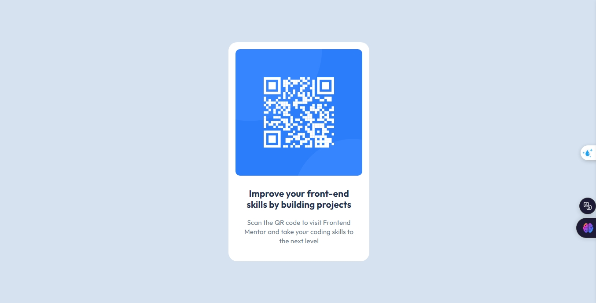

# QR Code Component

This project is a simple QR code component challenge from [Frontend Mentor](https://www.frontendmentor.io). The goal is to build a QR code component and get it to look as close as possible to the provided design.

## Table of Contents

- [Overview](#overview)
- [Screenshot](#screenshot)
- [Links](#links)
- [Built With](#built-with)
- [What I Learned](#what-i-learned)
- [Author](#author)

## Overview

This project is a solution to the QR Code Component challenge on Frontend Mentor. The challenge is to build a QR code component and make it look as close as possible to the design provided.

### Screenshot

### Links

- Live Site URL:(https://ibra7salah.github.io/qr-code-component-challenge/)
- Frontend Mentor Solution: [Insert your solution URL here](#)

## Built With

- HTML5
- CSS3
- [Google Fonts](https://fonts.google.com/specimen/Outfit)

## What I Learned

I learned how to:

- Create a centered component using CSS.
- Style text and images to match a design.
- Use Google Fonts in a project.

## Author

- Frontend Mentor - [@ibra7salah](https://www.frontendmentor.io/profile/ibra7salah)
- GitHub - [@ibra7salah](https://github.com/ibra7salah)
